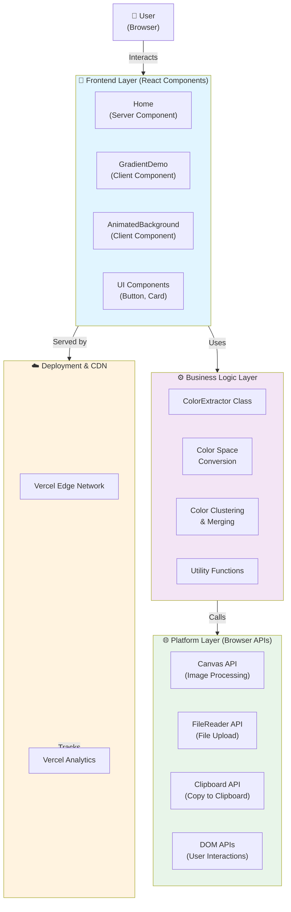
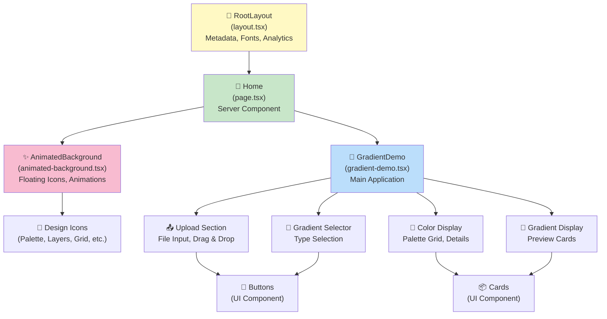
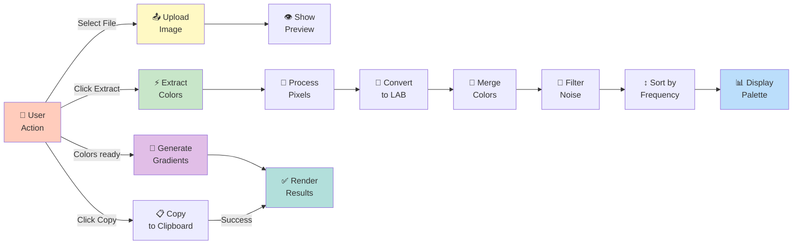
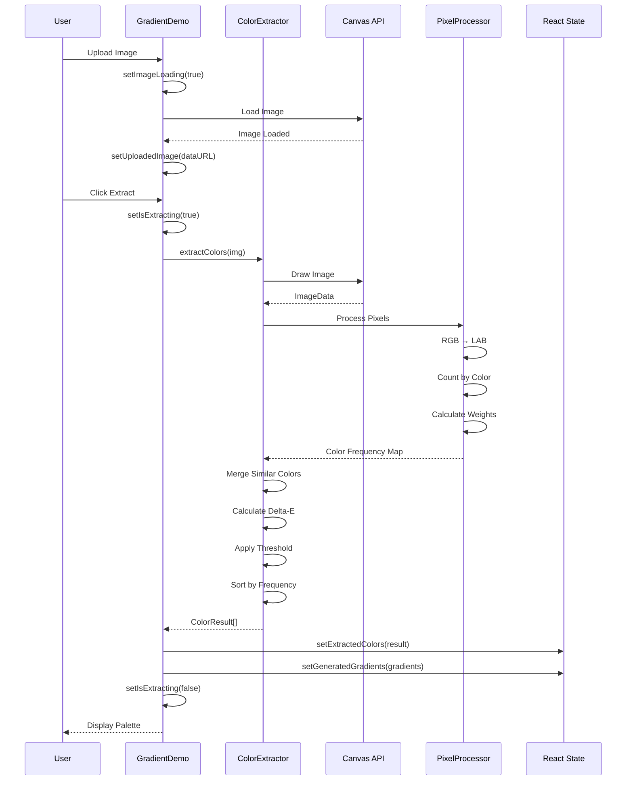
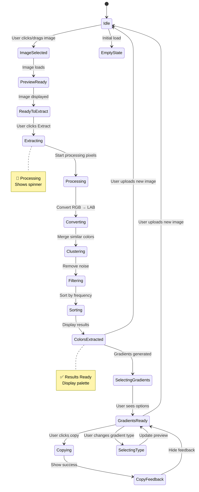
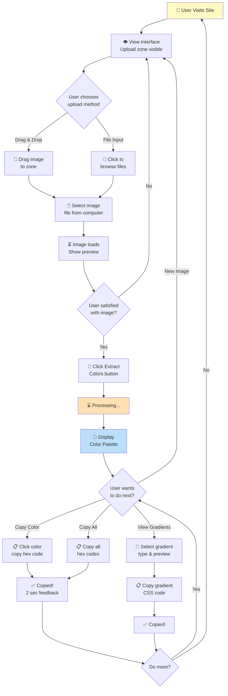
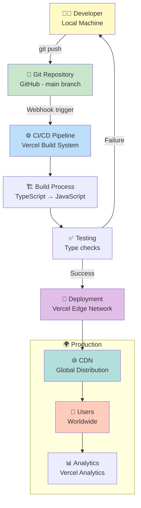
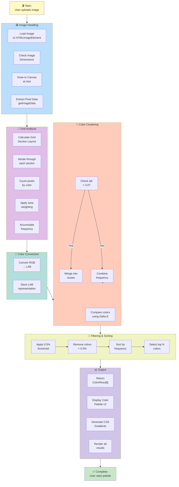

# System Diagrams & Visualizations

**Color Palette Extractor - Visual Documentation**  
**Version:** 2.0.0 | **Last Updated:** April 13, 2026

This document contains comprehensive diagrams illustrating the system architecture, data flows, state machines, and interactions.

---

## Table of Contents

1. [System Architecture Diagram](#system-architecture-diagram)
2. [Component Hierarchy Diagram](#component-hierarchy-diagram)
3. [Data Flow Diagram](#data-flow-diagram)
4. [Color Extraction Sequence Diagram](#color-extraction-sequence-diagram)
5. [Application State Diagram](#application-state-diagram)
6. [Color Processing State Machine](#color-processing-state-machine)
7. [User Interaction Flow Diagram](#user-interaction-flow-diagram)
8. [Class Diagram](#class-diagram)
9. [Deployment Architecture Diagram](#deployment-architecture-diagram)
10. [Process Flow Diagram](#process-flow-diagram)

---

## System Architecture Diagram



**Components:**
- **Frontend:** React components managing UI and user interactions
- **Business Logic:** Color extraction algorithms and data processing
- **Platform:** Native browser APIs for image/file handling
- **Deployment:** Vercel CDN for distribution and analytics

---

## Component Hierarchy Diagram



**Hierarchy Levels:**
- **Level 1:** Root layout with metadata
- **Level 2:** Home page component
- **Level 3:** Feature components (Gradient Demo, Animated Background)
- **Level 4:** Section components (Upload, Color Display, etc.)
- **Level 5:** UI primitives (Buttons, Cards)

---

## Data Flow Diagram



**Data Flow:**
1. User uploads image
2. Extraction processes pixels
3. Colors converted and merged
4. Results filtered and sorted
5. Display in palette
6. User can copy or generate gradients

---

## Color Extraction Sequence Diagram



**Sequence:**
1. User uploads image
2. Image loads into canvas
3. Pixels extracted and processed
4. Colors converted to LAB space
5. Similar colors merged using Delta-E
6. Results displayed to user

---

## Application State Diagram



**State Transitions:**
- **Idle** → **ImageSelected**: User uploads image
- **ImageSelected** → **PreviewReady**: Image loads
- **ReadyToExtract** → **Extracting**: User initiates extraction
- **Extracting** → **ColorsExtracted**: Processing complete
- **ColorsExtracted** → **GradientsReady**: Gradients generated
- **GradientsReady** → **Idle**: Upload new image

---

## Color Processing State Machine

```mermaid
stateDiagram-v2
    [*] --> LoadImage
    
    LoadImage --> CalculateDimensions: Image loaded
    CalculateDimensions --> DrawCanvas: Dimensions OK
    DrawCanvas --> ExtractImageData: Canvas ready
    
    ExtractImageData --> InitializeGridSections: Data extracted
    InitializeGridSections --> ProcessSection1: Start grid analysis
    
    ProcessSection1 --> CountPixels: Analyze pixels
    CountPixels --> WeightFrequency: Apply area weight
    WeightFrequency --> StoreCounts: Add to accumulator
    
    StoreCounts --> MoreSections{More sections?}
    MoreSections --> ProcessSection1: Yes
    MoreSections --> MergeColors: No - All sections done
    
    MergeColors --> CalculateDeltaE: Compare colors
    CalculateDeltaE --> CheckThreshold{ΔE < 3.0?}
    CheckThreshold --> MergeIntoCluster: Yes - Merge
    CheckThreshold --> KeepSeparate: No - Keep separate
    
    MergeIntoCluster --> MoreComparisons{More colors?}
    KeepSeparate --> MoreComparisons
    
    MoreComparisons --> CalculateDeltaE: Yes
    MoreComparisons --> ApplyFrequencyThreshold: No - All merged
    
    ApplyFrequencyThreshold --> RemoveNoise{Freq < 0.5%?}
    RemoveNoise --> DiscardColor: Yes
    RemoveNoise --> KeepColor: No
    
    DiscardColor --> MoreColors{More colors?}
    KeepColor --> MoreColors
    
    MoreColors --> ApplyFrequencyThreshold: Yes
    MoreColors --> SortByFrequency: No - All filtered
    
    SortByFrequency --> SelectTopN: Sort descending
    SelectTopN --> [*]
```

**Processing Stages:**
1. **Load & Prepare** - Load image, calculate dimensions
2. **Grid Analysis** - Divide into sections, count pixels
3. **Color Merging** - Use Delta-E to merge similar colors
4. **Noise Filtering** - Remove colors below 0.5% threshold
5. **Sorting** - Sort by frequency, return top N

---

## User Interaction Flow Diagram



**User Journey:**
1. Upload image (drag/drop or file input)
2. Preview image
3. Extract colors
4. Choose action: copy color, copy all, select gradient
5. Copy to clipboard
6. Repeat or select new image

---

## Class Diagram

```mermaid
classDiagram
    class ColorExtractor {
        -canvas: HTMLCanvasElement | null
        -ctx: CanvasRenderingContext2D | null
        
        +constructor()
        +extractColors(imageSource, maxColors, maxDimension, gridSize): Promise Color Result[]
        -loadImage(source): Promise HTMLImageElement
        -calculateDimensions(img, maxDimension): {width, height}
        -extractColorsWeightedGrid(imageData, maxColors, gridSize): Promise ColorResult[]
        -countPixelsByColor(imageData, startX, startY, endX, endY): Map
        -calculateGridSections(width, height, gridSize): GridSection[]
        -convertRGBtoLAB(rgb): LAB
        -convertLABtoRGB(lab): RGB
        -calculateDeltaE94(lab1, lab2): number
        -rgbToHex(rgb): string
        -hexToRgb(hex): string
    }
    
    class ColorResult {
        +color: string
        +rgb: RGB
        +lab: LAB
        +frequency: number
        +clusterSize: number
    }
    
    class RGB {
        +r: number
        +g: number
        +b: number
    }
    
    class LAB {
        +l: number
        +a: number
        +b: number
    }
    
    class GridSection {
        +startX: number
        +startY: number
        +endX: number
        +endY: number
    }
    
    class GradientDemo {
        -uploadedImage: string | null
        -imageLoading: boolean
        -extractedColors: ColorResult[]
        -isExtracting: boolean
        -generatedGradients: string[]
        -selectedGradientTypes: string[]
        -copiedColor: string | null
        
        +render(): JSX.Element
        -handleFileSelect(file): void
        -handleExtractClick(): Promise void
        -generateGradients(colors): string[]
        -copyColorToClipboard(color): Promise void
        -getContrastColor(hex): string
    }
    
    ColorExtractor --> ColorResult
    ColorExtractor --> RGB
    ColorExtractor --> LAB
    ColorExtractor --> GridSection
    GradientDemo --> ColorExtractor
    GradientDemo --> ColorResult
    
    note "Color Extraction Engine"
        Main algorithm for extracting
        dominant colors from images
    end note
    
    note "UI Component"
        React component managing
        user interface and state
    end note
```

**Class Relationships:**
- `ColorExtractor` creates `ColorResult[]` objects
- `ColorExtractor` uses `RGB`, `LAB`, `GridSection` types
- `GradientDemo` uses `ColorExtractor` instance
- `GradientDemo` displays `ColorResult` objects

---

## Deployment Architecture Diagram



**Flow:**
1. Developer commits and pushes to GitHub
2. Webhook triggers Vercel CI/CD
3. Build process compiles TypeScript
4. Tests verify no errors
5. Success → Deploy to edge network
6. Failure → Notify developer
7. CDN distributes globally
8. Analytics track usage

---

## Process Flow Diagram



**Process Stages:**
1. **Image Handling** - Load and prepare image data
2. **Grid Analysis** - Divide into sections and count pixels
3. **Color Conversion** - Convert RGB to LAB space
4. **Clustering** - Merge similar colors
5. **Filtering & Sorting** - Apply thresholds and rank by frequency
6. **Output** - Display results to user

---

## Viewing These Diagrams

These diagrams are written in **Mermaid** syntax, which is:
- ✅ Supported on GitHub (auto-renders in README and .md files)
- ✅ Supported on GitLab
- ✅ Supported in VS Code (with extension)
- ✅ Supported in many documentation tools

**To view in VS Code:**
1. Install "Markdown Preview Mermaid Support" extension
2. Open this file in VS Code
3. Preview rendered (Cmd/Ctrl+Shift+V)

**To convert to images:**
```bash
# Using mermaid CLI
npm install -g @mermaid-js/mermaid-cli

mermaid DIAGRAMS.md
# Generates PNG images for each diagram
```

---

## Legend

### Color Coding

- 🟨 **Yellow** - Start/Input
- 🟩 **Green** - Success/Output  
- 🟦 **Blue** - Processing
- 🟫 **Purple** - Complex Logic
- 🟦 **Cyan** - Data Storage
- 🟧 **Orange** - Error/Warning

### Shape Meanings

| Shape | Meaning |
|-------|---------|
| Rectangle | Process/Action |
| Diamond | Decision/Branch |
| Rounded | Start/End State |
| Circle | Component/Module |
| Cylinder | Storage/Database |

---

## Summary

This document contains **10 comprehensive diagrams** covering:

✅ **System Architecture** - Layered component design  
✅ **Component Hierarchy** - React component tree  
✅ **Data Flow** - How data moves through the system  
✅ **Sequence Diagram** - Step-by-step color extraction  
✅ **State Machine** - Application state transitions  
✅ **Processing State** - Color algorithm states  
✅ **User Flows** - User interaction journeys  
✅ **Class Diagram** - Object-oriented design  
✅ **Deployment** - CI/CD and cloud infrastructure  
✅ **Process Flow** - Complete end-to-end process  

Use these diagrams for:
- Understanding system architecture
- Onboarding new developers
- System documentation  
- Identifying bottlenecks
- Planning improvements
- Technical discussions

---

**Created with ❤️ for the Color Palette Extractor Project**

